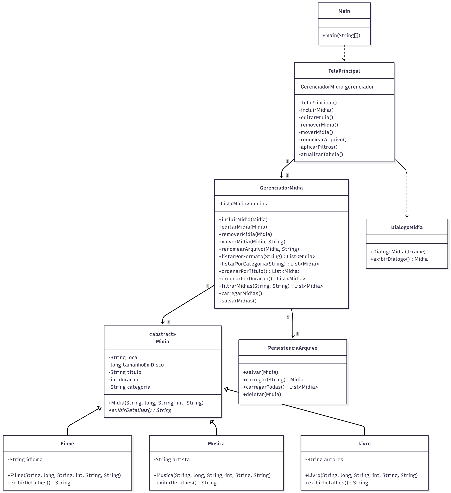
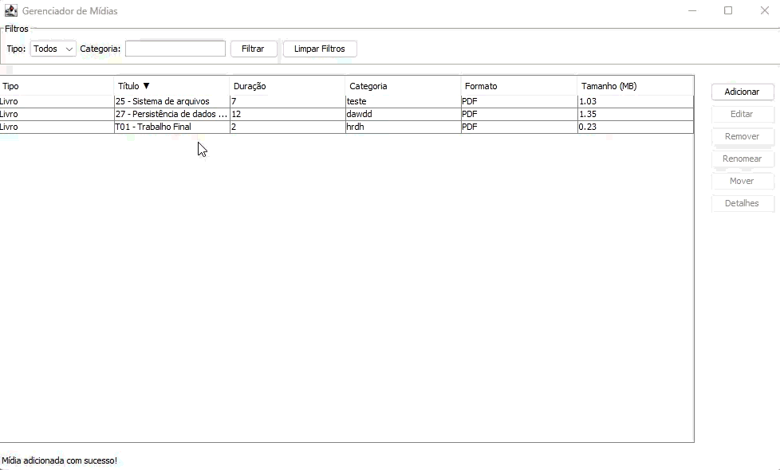

# Gerenciador de Mídias

Sistema para gerenciar arquivos de mídia (filmes, músicas e livros) com interface gráfica em Java Swing.

## 📋 Diagrama de Classes UML



> O diagrama completo mostra a arquitetura MVC do sistema com as camadas de modelo, controle, persistência e visualização.

## 🏗️ Arquitetura

O projeto segue o padrão **MVC (Model-View-Controller)** em três camadas:

- **Model (modelo)**: Classes de mídia (`Midia`, `Filme`, `Musica`, `Livro`)
- **Controller (controle)**: `GerenciadorMidia`
- **View (visao)**: `TelaPrincipal`, `DialogoMidia`
- **Persistência**: `PersistenciaArquivo` (arquivos `.tpoo`)

## 📦 Estrutura de Pacotes (resumida)

```
GerenciadorDeArquivosDeMidia/
├── src/
│   └── main/
│       └── java/
│           └── gerenciador_midia/
│               ├── model/
│               │   ├── Midia.java
│               │   ├── Filme.java
│               │   ├── Musica.java
│               │   └── Livro.java
│               ├── controller/
│               │   └── GerenciadorMidia.java
│               ├── enums/
│               │   ├── FilmeFormatoSuportado.java
│               │   ├── MusicaFormatoSuportado.java
│               │   └── LivroFormatoSuportado.java
│               ├── util/
│               │   └── MetadadosExtractor.java
│               ├── view/
│               │   ├── TelaPrincipal.java
│               │   └── DialogoMidia.java
│               └── Main.java
│
├── test/
│   └── java/
│       └── gerenciador_midia/
│           ├── model/
│           ├── controller/
│           └── util/
│
└── docs/
    └── diagrama-aplicacao.png
```

## ✨ Funcionalidades

- ✅ Incluir, editar e remover mídias
- ✅ Mover arquivos para novas pastas
- ✅ Renomear arquivos de mídia
- ✅ Listar por formato (filme, música, livro)
- ✅ Listar por categoria (ação, aventura, rock, etc.)
- ✅ Ordenar por título ou duração
- ✅ Combinar filtros (ex: livros de aventura)
- ✅ Persistência em arquivos `.tpoo`
- ✅ Carregamento automático ao iniciar

## 📊 Formatos Suportados

| Mídia   | Extensões Suportadas | Duração em      |
|---------|----------------------|-----------------|
| Filme   | MP4, MKV             | Minutos         |
| Música  | MP3                  | Segundos        |
| Livro   | PDF, EPUB            | Páginas         |

## 🎯 Conceitos de POO Aplicados

- **Herança**: Classe abstrata `Midia` com subclasses `Filme`, `Musica` e `Livro`
- **Polimorfismo**: Método `exibirDetalhes()` implementado de forma específica em cada subclasse
- **Encapsulamento**: Atributos privados com métodos públicos de acesso

## 🛠️ Tecnologias

- Java 25 (JDK 25)
- Maven (build)
- Swing (Interface Gráfica)
- JUnit 5 (Testes Unitários)
- Apache Tika (leitura/metadados)
- Apache PDFBox (manipulação de PDFs)

## 🚀 Como Executar (mínimo)

1. Clone o repositório

   git clone <URL-do-repositório>

2. Construa com Maven:

   mvn package

3. Execute a aplicação (jar gerado):

   mvn package; java -jar target/GerenciadorDeArquivosDeMidia-1.0-SNAPSHOT.jar

Ou abra o projeto na sua IDE e execute a classe `gerenciador_midia.Main`.


## 🖥️ Demonstração de uso da tela:

Aqui vão GIFs mostrando o que dá pra fazer na prática.

### ➕ Adicionar arquivo


### 🔎⬆️ Filtrar e ordenar


### ℹ️ Ver detalhes


## 🧪 Testes

Execute os testes JUnit com Maven:

```
# Todos os testes
mvn test
```

Ou execute os testes pela sua IDE.

## 👥 Equipe

- Everton — design da arquitetura MVC, implementação das telas e testes unitários.
- Eloiza — implementação da persistência, parte do gerenciador e classes models filhas.
- Leslie — implementação da classe midia e parte do gerenciador.

---
